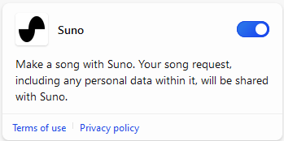

[Voltar ao índice](https://microsoftlearning.github.io/MS-4012-Microsoft-Copilot-Web-Based-Interactive-Experience-for-Executives/)

# Microsoft Copilot (Escopo Web)

## Copilot e modelos de linguagem grande

### Pontos de discussão

O Microsoft Copilot na Web oferece um assistente pessoal da plataforma IA que pode responder a perguntas e ajudar em tarefas gerais. Posso fazer perguntas e ele me dará respostas semelhantes às que qualquer pessoa com formação universitária poderia dar.

Quando você ou sua organização usam o Copilot com Proteção de Dados Comerciais, seu chat não é salvo. Todos os dados são criptografados e a Microsoft não retém nenhum de seus prompts ou respostas. Eles não são usados para treinar o modelo, portanto, você pode ter certeza de que suas informações pessoais e organizacionais serão mantidas em sigilo.

Por exemplo, posso fazer uma pergunta de conhecimento geral como essa e obter muitas informações excelentes. Você pode pensar nisso como tendo um modelo conceitual básico do mundo que pode ser usado para responder a perguntas.

**Exemplo:**
- **Prompt:** O que você pode me dizer sobre elefantes?
- **Resposta:** (Discuta a resposta)

O Copilot usa LLMs (modelos de linguagem grande) treinados em grandes quantidades de informações, incluindo pesquisas e resultados do Bing. Mas o Copilot não é apenas um verificador de fatos. Podemos usar o Copilot como um mecanismo de raciocínio geral que pode tirar suas dúvidas e raciocinar sobre elas de forma estocástica. No setor, chamamos isso de inferência.

**Exemplo:**
- **Prompt:** Estou mais interessado no poder de um elefante. Quantos humanos seriam necessários para vencer um cabo de guerra com um elefante? OBSERVAÇÃO: tenha em mente a região e seu público, pois nem todo mundo conhece o termo "cabo de guerra", então você pode ter que modificar de acordo. 
- **Resposta:** (Discuta a resposta)

O Copilot foi capaz de fazer suposições e estabelecer conexões entre pedaços de conhecimento para me dar uma resposta mais sutil à minha pergunta. À medida que melhoramos o Copilot, estamos aprendendo muito sobre o que esses LLMs fazem bem ou mal, e estamos incorporando esse conhecimento ao produto à medida que o construímos.

### Etapas de demonstração

> **OBSERVAÇÃO:** se você quiser usar seus próprios prompts, comece com um tópico de conhecimento geral que seja interessante para você ou seu cliente.

1. Alterne para a guia do Edge com o Copilot aberto e o Escopo Web selecionado.

    

1. Na caixa de texto **Pergunte-me qualquer coisa...**, copie e cole o prompt dos documentos da biblioteca de prompts ou digite:

    ```text
    What can you tell me about elephants?
    ```
1. Selecione o botão **Enviar**.
1. Na caixa de texto **Pergunte-me qualquer coisa...**, copie e cole o prompt:

    ```text
    I’m more interested in the power of an elephant. How many humans would it take to win a tug-of-war with an elephant?
    ```
1. Selecione o botão **Enviar**.

## Fundamentação

### Pontos de discussão

Mas o que leva esse poder para o próximo nível é a capacidade de aterrar o Copilot em dados e conhecimentos externos. Às vezes, isso é chamado de RAG (Geração Aumentada de Recuperação). Esse é o processo de fornecer informações adicionais ao modelo de linguagem relevantes para a tarefa em questão.

Podemos basear nossas perguntas em todos os tipos de dados e documentos, por exemplo, o relatório de empregos da Secretaria de Estatísticas Trabalhistas dos Estados Unidos (Bureau of Labor Statistics). Esse é um documento enorme, publicado anualmente, repleto de dados sobre empregos e tendências de emprego nos Estados Unidos. O Copilot é capaz de sair e encontrar essas informações, entendê-las e me dar uma resposta à minha pergunta em tempo real. Ele também me dá referências que me mostram de onde o Copilot obteve essas informações, por exemplo, do site do Bureau of Labor Statistics. Isso significa que posso verificar onde o Copilot obteve suas informações e obter mais contexto, porque este é o Copilot, não o Autopilot.

### Etapas de demonstração

1. Inicie um novo tópico clicando em **Novo tópico**.

    

1. Na caixa de texto **Pergunte-me qualquer coisa...**, copie e cole o prompt:

    ```text
    Can you give me a list of the labor force participation rates from the Bureau of Labor Statistics over the last 5 years?
    ```
1. Selecione o botão **Enviar**.
1. Na resposta, ao lado de **Saiba mais**, pause o mouse sobre uma ou duas das referências.

## Habilidades adicionais do Copilot

### Pontos de discussão

Isso é ótimo, mas eu realmente gostaria de ver um gráfico desses dados. Infelizmente, o Copilot não pode desenhar um gráfico agora, mas isso não significa que precisamos parar por aqui. À medida que construímos o Copilot, estamos adicionando habilidades diferentes. Habilidades são maneiras pelas quais o Copilot pode usar seu poder de raciocínio para resolver problemas.

Outra habilidade que eu sei que o Copilot tem é a capacidade de codificar. Vou lembrar ao Copilot que ele sabe codificar e ver se consigo fazer com que ele escreva o código Python para o gráfico que eu queria.

**Exemplo:**
- **Prompt:** você pode me dar uma lista das taxas de participação na força de trabalho do Bureau of Labor Statistics nos últimos 5 anos? Também ouvi dizer que você pode codificar. Você pode pegar os dados do bls.gov e escrever o código Python que produziria o gráfico que estou procurando?
- **Resposta:** (Discuta a resposta)

Com o tempo, esperamos que esses tipos de processos se tornem mais fáceis e automatizados.

### Etapas de demonstração

1. Inicie um novo tópico clicando em **Novo tópico**.

    

1. Na caixa de texto **Pergunte-me qualquer coisa...**, copie e cole o prompt:

    ```text
    Can you give me a list of the labor force participation rates from the Bureau of Labor Statistics over the last 5 years? I also heard that you could code. Can you grab the data from bls.gov and then write the Python code that would produce the graph I'm looking for?
    ```

1. Selecione o botão **Enviar**.

## Etapas de demonstração opcionais

### Reconhecimento de imagens

Primeiro baixe o seguinte: [**What is this image.png**](https://github.com/MicrosoftLearning/MS-4012-Microsoft-Copilot-Unlocked/raw/master/Resourcefiles/what_is_this_image.PNG)

1. Inicie um novo tópico clicando em **Novo tópico**.

    

1. Selecione o ícone **Adicionar uma imagem** na parte inferior da página.

    

1. Selecione **Carregar deste dispositivo**.
1. Navegue até onde você baixou a imagem, selecione **What is this picture.png** e, em seguida, selecione **Abrir**.
1. Na caixa de texto **Pergunte-me qualquer coisa...**, digite o prompt:

    ```text
    What is this picture?
    ```

1. Selecione o botão **Enviar**.

### Mostre como o Copilot pode criar imagens

1. Na caixa de texto **Pergunte-me qualquer coisa...**, copie e cole o prompt:

    ```text
    Copilot, make a banner for a hamburger stand. Make it friendly and show people enjoying a hamburger.
    ```

1. Selecione o botão **Enviar**.

### Mostre como o Copilot pode escrever uma música

1. Alterne para uma nova sessão do navegador conectada a uma conta pessoal.

> **OBSERVAÇÃO:** Você precisará usar uma conta pessoal para esta etapa. As contas corporativas não funcionarão.

1. No canto superior direito, selecione **Plug-ins**.

    

1. Na lista de plug-ins disponíveis, habilite **o Suno**.

    

    > **OBSERVAÇÃO:** para usar o Suno, você deve iniciar um novo tópico no Copilot e habilitar o Suno.

1. Na caixa de texto **Pergunte-me qualquer coisa...**, copie e cole o prompt:

    ```text
    Write a country song about Microsoft Copilot, extolling its virtues as an AI companion. Make it catchy, upbeat, and a little quirky.
    ```

1. Selecione o botão **Enviar**.

[Voltar ao índice](https://microsoftlearning.github.io/MS-4012-Microsoft-Copilot-Web-Based-Interactive-Experience-for-Executives/)
