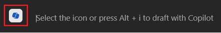

---
demo:
  title: 'Demonstração: Copilot no Word'
---

[Voltar ao índice](https://microsoftlearning.github.io/MS-4012-Microsoft-Copilot-Web-Based-Interactive-Experience-for-Executives/)

# Copilot no Word

## Configuração da demonstração

Os documentos de exemplo podem ser encontrados no repositório MS-4012 GitHub [aqui](https://github.com/MicrosoftLearning/MS-4012-Microsoft-Copilot-Unlocked/tree/master/Resourcefiles).

Os arquivos específicos que estão sendo usados neste exercício são:

- [**ContosoLearn App Overview.docx**](https://github.com/MicrosoftLearning/MS-4012-Microsoft-Copilot-Unlocked/raw/master/Resourcefiles/ContosoLearn%20App%20Overview.docx)
- [**ContosoLearn Competitor SWOT.docx**](https://github.com/MicrosoftLearning/MS-4012-Microsoft-Copilot-Unlocked/raw/master/Resourcefiles/ContosoLearn%20Competitor%20SWOT.docx)
- [**ContosoLearn Value Proposition.docx**](https://github.com/MicrosoftLearning/MS-4012-Microsoft-Copilot-Unlocked/raw/master/Resourcefiles/ContosoLearn%20Value%20Proposition.docx)
- (Opcional – veja as instruções abaixo) [**Chamada em conferência de resultados do segundo trimestre do Microsoft FY24**](https://github.com/MicrosoftLearning/MS-4012-Microsoft-Copilot-Unlocked/raw/master/Resourcefiles/Microsoft_FY24_Second_Quarter_Earnings_Conference_Call.docx) 

> **OBSERVAÇÃO:** pode levar até 10 minutos para que esses arquivos sejam sincronizados com o OneDrive. Para agilizar esse processo, você pode abrir o documento e fechá-lo, o que o adicionará à sua lista de MRU (Usados Mais Recentemente).

## Pontos de discussão

Na Experiência Interativa, fizemos um brainstorming de novas ideias de aplicativos ou serviços, criamos identidade de marca e ativos de marketing e analisamos o cenário competitivo. Mas como podemos dar um passo adiante?

Com o Copilot no Word, podemos transformar o processo de criação e refinamento de documentos, permitindo que você produza conteúdo atraente com facilidade.

Nesta demonstração, pegaremos os documentos que acabamos de criar e os transformaremos juntos para criar um relatório de análise estratégica. Além disso, ajustaremos o formato e o tom para garantir que o conteúdo se alinhe perfeitamente com nossos objetivos.

## Etapas de demonstração

1. Inicie o Microsoft Word na área de trabalho ou digitando **Word.new** em uma nova guia do Edge.
1. Clique no corpo do documento e selecione o **ícone do Copilot** exibido.

    

1. No Word, a janela **Rascunho com Copilot** agora deve ser exibida. No campo de prompt, insira o seguinte prompt:

    ```text
    Create a comprehensive strategic analysis report for ContosoLearn using the following files as references: /ContosoLearn App Overview, /ContosoLearn Competitor SWOT, and /ContosoLearn Value Proposition. The strategic analysis report should include the following sections:
        
    Executive Summary
    App Overview
    Market Research
    Competitor SWOT Analysis
    Value Proposition
    Conclusion
    ```

    > **IMPORTANTE:** você precisará digitar novamente "/" e selecionar os arquivos corretos na lista de MRU (Usados mais recentemente) para que isso funcione corretamente.

1. O Copilot agora gerará um rascunho do relatório de análise estratégica com base no prompt fornecido. Assim que o Copilot terminar, a seguinte janela de prompt será exibida:

    
    
    No campo de prompt, insira o seguinte:

    ```text
    Remove the "Market Research" section and add a "Competitive Landscape" section. Ensure the content is concise and aligns with the overall tone of the document.
    ```

    > **OBSERVAÇÃO:** se o Copilot para Word não estiver cooperando com você, você poderá usar o seguinte link para acessar o documento gerado: [**Exemplo de Saída do Word do ContosoLearn**](https://github.com/MicrosoftLearning/MS-4012-Microsoft-Copilot-Unlocked/raw/master/Allfiles/Demo%20Sample%20Docs/ContosoLearn_Example_Word_Output.docx).

## Etapas de demonstração opcionais

### Resumir um documento grande

1. Baixe e abra o seguinte arquivo no Word em sua área de trabalho: [**Chamada em conferência de ganhos do segundo trimestre do Microsoft FY24**](https://github.com/MicrosoftLearning/MS-4012-Microsoft-Copilot-Unlocked/raw/master/Resourcefiles/Microsoft_FY24_Second_Quarter_Earnings_Conference_Call.docx).
1. No Word, na faixa de opções, selecione o **ícone do Copilot**.

    

1. No campo **Pergunte-me qualquer coisa sobre este documento**, copie e cole o prompt ou digite: 

    ```text
    Based on the document, how did AI impact Microsoft's earnings this year?
    ```

1. Selecione **Enviar**.  
1. No campo **Pergunte-me qualquer coisa sobre este documento**, copie e cole o prompt ou digite: 

    ```text
    Copilot, generate a FAQ based on this document.
    ```
    
1. Selecione **Enviar**.

[Voltar ao índice](https://microsoftlearning.github.io/MS-4012-Microsoft-Copilot-Web-Based-Interactive-Experience-for-Executives/)
